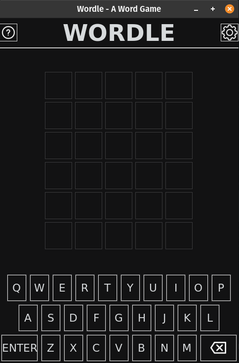

# PyWordle
A Wordle clone written in Python and Tkinter.

## Features
- play as much as you want unlike original wordle
- toggle full screen mode with <F11>

## TODO:
- [X] new_game function not working, make it work
- [X] add a virtual keyboard
- [X] make the boxes border white if it contains a letter that has not been checked yet
- [X] highlight used letters on the virtual keyboard
- [X] refactor code to use a MVC approach
- [X] toast to show error messages
- [X] an overlay window to ask if you wanna play another game
- [ ] after solving a puzzle a timer will start for 1 hour and you can't solve another puzzle unitl it ends (maybe use configparser)
- [ ] add a way to not pick the same random word again (store all the words already picked by the program)
- [ ] add settings menu
- [ ] add a option to add a custom wordlist
- [ ] add a score keeping mechanism
- [ ] add help menus
